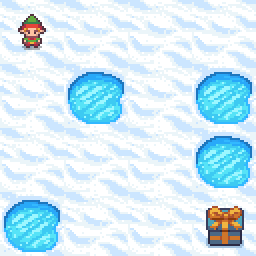
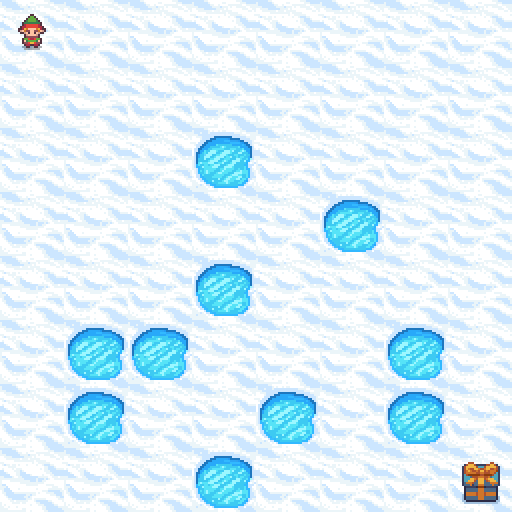
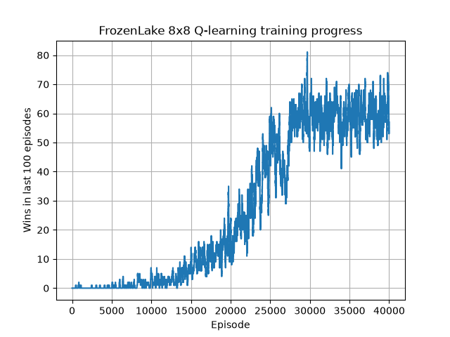
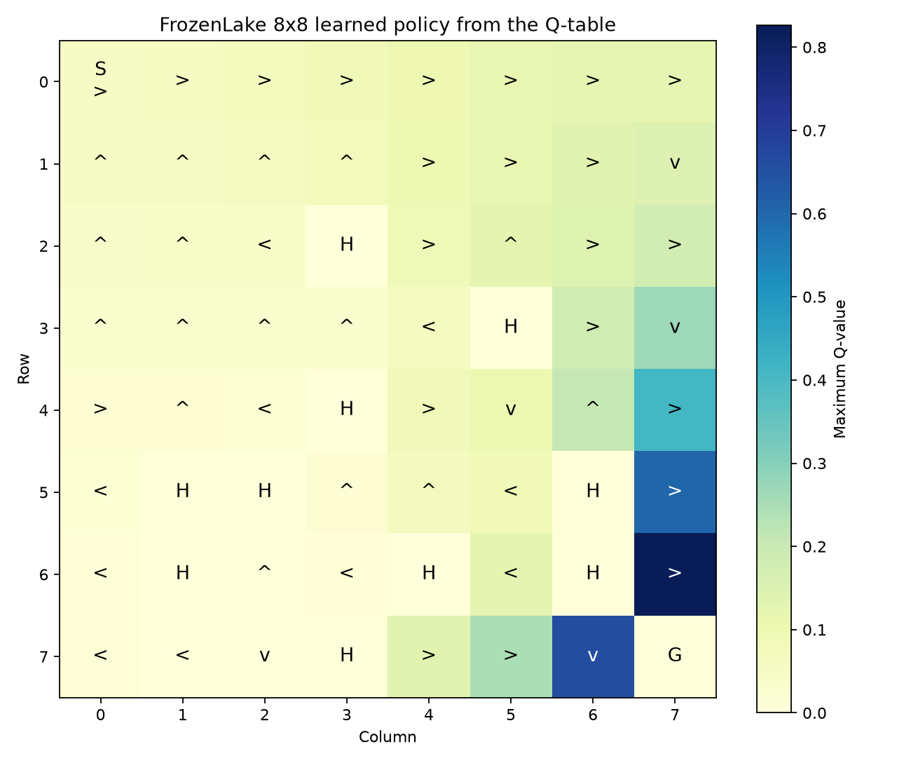

# FrozenLake Q-Learning


A reproducible tabular Q-learning agent for Gymnasium's `FrozenLake-v1` environment. The project demonstrates epsilon-greedy exploration, temporal-difference learning, policy evaluation, and visual analysis on the standard 4x4 and 8x8 slippery maps.

<p align="center">
  
  
</p>

## Results

Saved policies were evaluated greedily over 1,000 seeded test episodes. The slippery environment remains stochastic, so an effective policy cannot guarantee a win in every episode.

| Environment | Training episodes | Before training | After training |
|---|---:|---:|---:|
| 4x4 slippery | 20,000 | 1.4% | **73.9%** |
| 8x8 slippery | 40,000 | 0.2% | **75.8%** |

### 8x8 training progress



### 8x8 learned policy



The numerical Q-table heatmaps and full experiment metadata are available in [`results/4x4`](results/4x4) and [`results/8x8`](results/8x8).

## Q-Learning

The agent stores one value for every state-action pair and applies the update:

```text
Q(s, a) <- Q(s, a) + alpha * [reward + gamma * max Q(s', a') - Q(s, a)]
```

| Parameter | Value |
|---|---:|
| Learning rate, alpha | 0.1 |
| Discount factor, gamma | 0.95 |
| Initial epsilon | 1.0 |
| Training seed | 42 |
| Evaluation seed | 12345 |

The Q-table has shape `16 x 4` for the 4x4 map and `64 x 4` for the 8x8 map.

## Features

- Standard 4x4 and 8x8 FrozenLake maps.
- Slippery and deterministic transition modes.
- Random tie-breaking between equally valued actions.
- Reproducible before/after evaluation.
- Training progress, learned-policy, and Q-table visualisations.
- Saved models and JSON experiment metadata.
- Command-line interface for training, demos, and visualisation.

## Installation

Python 3.10 or newer is recommended.

```bash
git clone https://github.com/alexandrran/frozenlake-qlearning-project.git
cd frozenlake-qlearning-project
python -m venv .venv
```

Activate the environment on Windows:

```powershell
.venv\Scripts\activate
```

Install the dependencies:

```bash
pip install -r requirements.txt
```

## Usage

Train an agent on the slippery 8x8 map:

```bash
python frozen_lake_q.py train --map-name 8x8 --slippery --episodes 40000
```

Train on the deterministic 4x4 map:

```bash
python frozen_lake_q.py train --map-name 4x4 --no-slippery --episodes 20000
```

Watch a saved policy:

```bash
python frozen_lake_q.py demo --map-name 8x8 --slippery --demo-episodes 3
```

Recreate policy and Q-table images without retraining:

```bash
python frozen_lake_q.py visualize --map-name 8x8 --slippery
```

## Project Structure

```text
.
+-- assets/maps/          FrozenLake screenshots
+-- results/4x4/          4x4 model, metrics, and figures
+-- results/8x8/          8x8 model, metrics, and figures
+-- frozen_lake_q.py      Training, evaluation, CLI, and visualisation
+-- requirements.txt      Project dependencies
```

Each `metrics.json` records the map, slippery mode, episode count, hyperparameters, seeds, and before/after success rates. Training the same map again replaces that map's saved artifacts.
